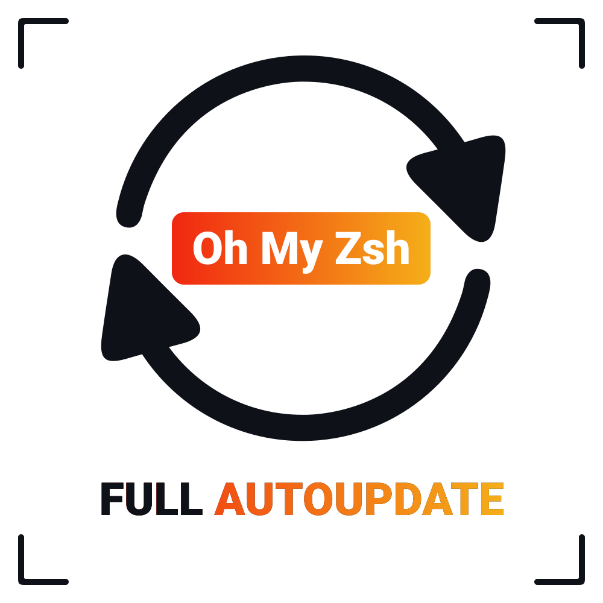
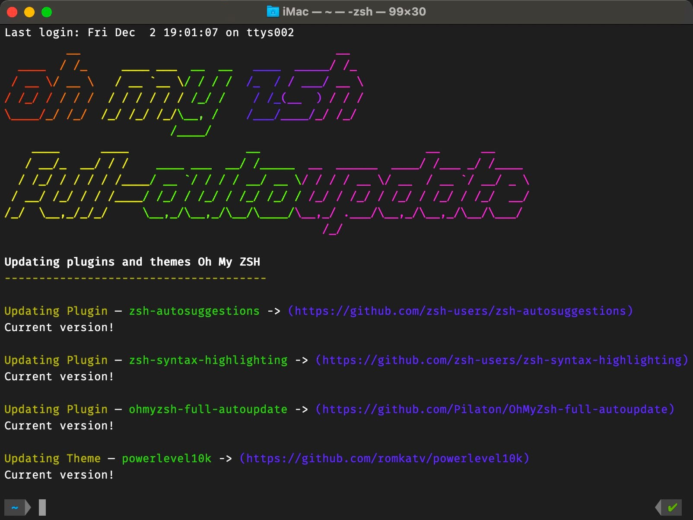

<div align="center">
    <a href="https://github.com/Pilaton/OhMyZsh-full-autoupdate">
        
    </a>
    <h1>🍃 OhMyZsh Full-autoupdate</h1>
    <h4>Automatic update of custom plugins and themes <a href="https://github.com/ohmyzsh/ohmyzsh">Oh My Zsh</a></h4>
</div>

<br>

## What is it

As you probably know, when you update Oh My Zsh, your plugins and themes installed in the `~/.oh-my-zsh/custom` folder are not updated.  

This plugin solves this problem and automatically updates your plugins and themes.

## Installing

1. Clone this repository into `$ZSH_CUSTOM/plugins` (`~/.oh-my-zsh/custom/plugins`)

    ```bash
    git clone https://github.com/Pilaton/OhMyZsh-full-autoupdate.git ${ZSH_CUSTOM:-~/.oh-my-zsh/custom}/plugins/ohmyzsh-full-autoupdate
    ```

2. Add the plugin to the Oh My Zsh plugin list in the `~/.zshrc` file:

    ```bash
    plugins=(... ohmyzsh-full-autoupdate)
    ```

3. Start a new terminal session.

## Usage 🚀

The plugin **works completely automatically**.  
The update of all OMZ themes and plugins is triggered the next time a new terminal session is opened, after the update of Oh My Zsh.  
The update frequency depends on the Oh My Zsh settings, by default every 13 days.  

💡 Note: It can be changed with the parameter `export UPDATE_ZSH_DAYS=13` in `~/.zshrc`.

<br>
<div align="center">
    
</div>
<br>

## Manual start

If you still need to start the update manually, just type `omz update` in the terminal, wait for the Oh My Zsh update to finish and restart the terminal. 😎

## License

MIT © [Pilaton](https://github.com/Pilaton)
